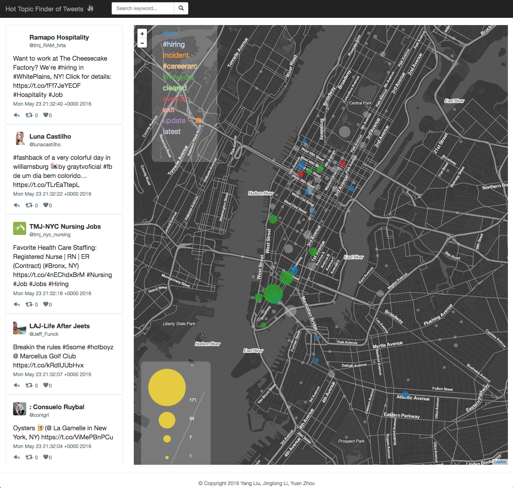

# Hot Topic Finder of Twitter

This project is trying to visualize the most recent twitter activities in NYC hoping to get a picture of trending topics and their geographical distribution. It's a course project for the Information Visualization at NYU Tandon by Professor Bertini.

The project fetches tweets geolocated in NYC, and transmit them to connected browsers. At the client side, a quad tree is maintained to store the hierarchical cluster/word frequency information. This makes tweet grouping automatically adjusted by the zooming area to reach a balance of general/details information.

Screenshot: https://vimeo.com/167764465

Website: http://twitter-nyc.com

Documentation: [report.pdf](assets/report.pdf)
